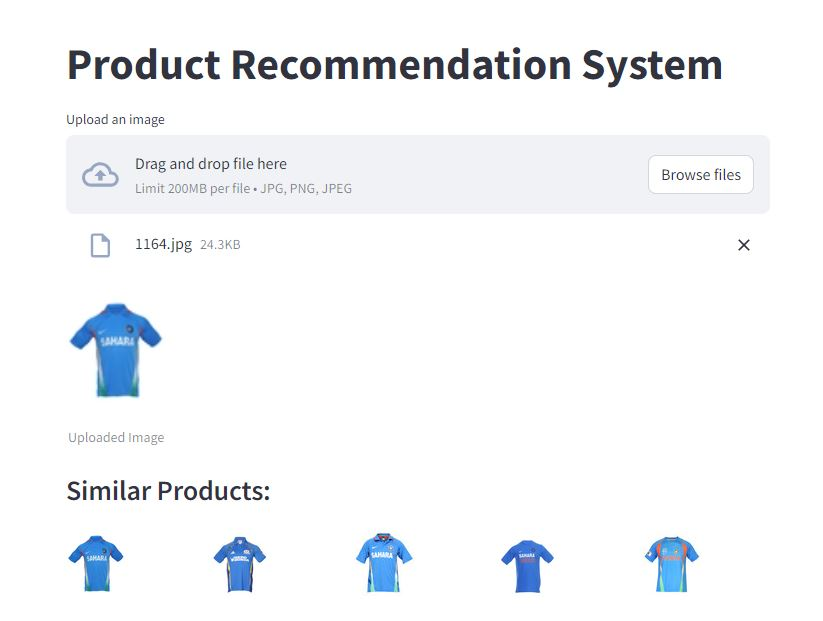

# Fashion Product Recommendation System

## Overview
This repository contains the code for a Fashion Product Recommendation System built using TensorFlow, scikit-learn, and Streamlit. The system utilizes a pre-trained ResNet50 model for feature extraction and nearest neighbor algorithm for similarity search, enabling users to discover similar fashion items based on uploaded images.

    
    
    

## Features
- Upload an image to find similar fashion products
- Display similar products in a user-friendly interface using Streamlit
- Leveraging ResNet50 for feature extraction and nearest neighbor algorithm for similarity search

## Installation
1. Clone the repository:
git clone https://github.com/Akhilpm156/Fashion_Product_Recommendation_System.git

3. Install the required dependencies:
pip install -r requirements.txt

## Usage
1. Navigate to the project directory:
cd Fashion_Product_Recommendation_System

3. Run the Streamlit app:
streamlit run app.py

3. Upload an image to find similar fashion products.

## Project Structure
- `app.py`: Streamlit application for the Fashion Product Recommendation System.
- `helper.py`: Helper script for feature extraction and dataset preprocessing.
- `images/`: Directory containing images used for feature extraction.
- `uploads/`: Directory where uploaded images are stored temporarily.
- `feature_vector.pkl`: Pickle file containing feature vectors extracted from the dataset images.
- `filepath.pkl`: Pickle file containing file paths of the dataset images.
- `requirements.txt`: File containing the required dependencies for the project.

